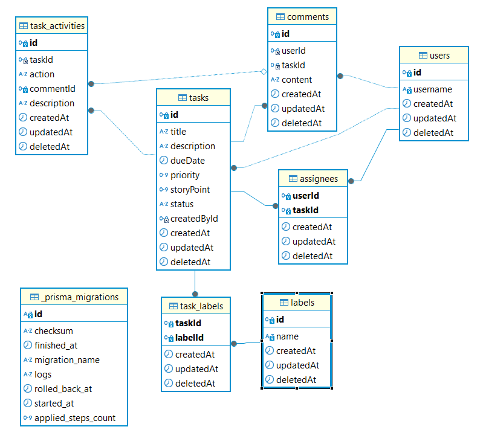

# Database Design

> \*Sort by alphabatical order

> \*In real world application, you probably need a more robust primary key such as UID or ULID. For simplicity, we will just use `int` and `autoincrement` for this project.

> \*`deletedAt` is used to support soft delete feature. Note that we use hard delete for pivot tables for ease of maintain.

## assignees

Pivot table too link `users` and `tasks`.

Rules:

1. One task can have one or many assignees.

| column    | type     | key    | description                |
| --------- | -------- | ------ | -------------------------- |
| userId    | int      | pk, fk | composite key. FK to users |
| taskId    | int      | pk, fk | composite key. FK to tasks |
| createdAt | datetime |        | created date time          |
| updatedAt | datetime |        | updated date time          |
| deletedAt | datetime |        | deleted date time          |

## comments

support simple text-based comment

Rules:

1. Each comment belongs to exactly one user
2. Each comment belongs to exactly one task

| column    | type     | key | description       |
| --------- | -------- | --- | ----------------- |
| id        | int      | pk  | identifier        |
| userId    | int      | fk  | FK to users       |
| taskId    | int      | fk  | FK to tasks       |
| content   | varchar  |     | the comment       |
| createdAt | datetime |     | created date time |
| updatedAt | datetime |     | updated date time |
| deletedAt | datetime |     | deleted date time |

## labels

| column    | type     | key | description       |
| --------- | -------- | --- | ----------------- |
| id        | int      | pk  | identifier        |
| name      | varchar  | pk  | the label         |
| createdAt | datetime |     | created date time |
| updatedAt | datetime |     | updated date time |
| deletedAt | datetime |     | deleted date time |

## tasks

| column      | type     | nullable | key | description                         |
| ----------- | -------- | -------- | --- | ----------------------------------- |
| id          | int      |          | pk  | identifier                          |
| title       | varchar  |          |     | title                               |
| description | varchar  |          |     | task description                    |
| dueDate     | datetime | yes      |     | deadline                            |
| priority    | number   | yes      |     | 1-low, 3-high                       |
| storyPoint  | number   | yes      |     | story point, min 1, max 99          |
| status      | varchar  | yes      |     | task status: OPEN, ASSIGNED, CLOSED |
| createdById | number   |          | fk  | FK to users                         |
| createdAt   | datetime |          |     | created date time                   |
| updatedAt   | datetime |          |     | updated date time                   |
| deletedAt   | datetime |          |     | deleted date time                   |

## task_labels

Pivot table to link `tasks` and `labels`

Rules:

1. one task can have zero or many labels.

| column    | type     | key    | description                 |
| --------- | -------- | ------ | --------------------------- |
| taskId    | int      | pk, fk | composite key, FK to tasks  |
| labelId   | int      | pk, fk | composite key, FK to labels |
| createdAt | datetime |        | created date time           |
| updatedAt | datetime |        | updated date time           |
| deletedAt | datetime |        | deleted date time           |

## users

| column    | type     | key | description       |
| --------- | -------- | --- | ----------------- |
| id        | int      | pk  | identifier        |
| username  | varchar  |     | username          |
| createdAt | datetime |     | created date time |
| updatedAt | datetime |     | updated date time |
| deletedAt | datetime |     | deleted date time |
